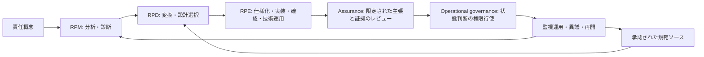

# Responsibility Pathway Design（RPD）

> **AIが関与する社会技術システムにおいて、判断・委任・実行・中断・回復・残余影響をまたいで責任のつながりを設計するための研究枠組み。**

**Language:** [English](./README.md) · 日本語

**現在の状態:** **provisional, reviewable RPD v0.1 research baseline（暫定的かつレビュー可能なRPD v0.1研究ベースライン）**。これは内部整合性と検査可能性を示す表現であり、外部妥当性確認、標準化、認証、法的権威、安全性・公平性・適合性の証明、本番運用準備、運用許可を意味しません。

[はじめに](./START-HERE.md) · [理論スタック](./docs/theory-stack-and-interfaces.md) · [変換カーネル](./docs/transformation-kernel-v0.1.md) · [規範ソース入力契約](./docs/normative-source-input-contract-v0.1.md) · [検証・妥当性語彙](./docs/verification-validation-vocabulary-v0.1.md) · [安定化監査](./docs/rpd-v0.1-stabilization-and-release-readiness-audit.md) · [パターン言語](./docs/pattern-language-v0.1.md) · [境界インターフェース](./docs/rpd-rpe-assurance-operational-governance-boundary-v0.1.md) · [GitHub Pages](https://yutorikomeiji.github.io/responsibility-pathway-design/)

---

## RPDが扱う問題

AIが判断や実行へ関与する場面では、責任者を指名すること、ログを残すこと、あるいは人間による確認工程を追加することだけでは、責任経路が維持されるとは限りません。

RPDは、次の問いを設計課題として扱います。

- 責任を伴う遷移はどこで発生するか
- 権限、能力、証拠、介入可能性はどこで分断されるか
- 責任はどのように人間または組織へ戻るか
- 誰が停止、異議申立て、修復、補償、再開、残余影響の管理を行えるか
- RPMで診断された弱点、または正当に承認された規範的制約を、どのようにレビュー可能な設計へ変換するか

## 中核となる位置づけ



RPDは、主に次の間にある**設計変換層**です。

- **Responsibility Pathway Model（RPM）** — 分析と診断
- **Responsibility Pathway Engineering（RPE）** — 仕様化、実装、確認、保守、技術運用

RPDは、RPM所見とは別経路で、明示的に承認された規範ソース入力を受け取ることもあります。その場合、出典権威、適用範囲、解釈、不確実性、競合、承認、失効、再検討条件を保持しなければなりません。

Assuranceは限定された主張と証拠をレビューします。継続、制約、停止、再設計、廃止を最終的に決定する権限は、人間または制度上のOperational Governanceに残ります。

## 設計変換の基本形

```text
入力根拠
  → 設計目的
  → 検証可能な要求
  → 介入案
  → トレードオフ記録
  → 選択された設計
  → 検証義務
  → Assuranceおよび再開条件
```

## 長期方向：規範ソースをreview可能な設計へ変換する

RPDは、法令、公的ガイドライン、標準、組織規程、専門職上の義務、影響当事者とのcommitmentから生じる責任要求を、review可能な設計へ変換するための規律ある中間層を目指します。

ただし、RPD自身が規範要求を創設、自動解釈、最終確定することは目標ではありません。規範入力を設計へ取り込む前に、特定された人間または制度が、出典権威、適用範囲、解釈、不確実性、競合、承認状態、review owner、失効、再検討条件を確定する必要があります。

```text
公式または正当に承認された規範ソース
        ↓ 人間・制度による解釈、適用範囲確認、承認
承認された規範ソース記録
        ↓
review可能な設計目的と検証可能な要求
        ↓
介入案、trade-off、検証義務、人間への返却経路
        ↓
RPE実装、別系統のAssurance、Operational Governance
```

将来対象には、EUのAI規制枠組み、日本の公的AIガバナンス指針、国際・業界標準、組織固有要求などに対する人間審査済みmappingが含まれ得ます。ただし、repository内の設計成果物だけで、法的正確性、準拠、適合、認証、運用許可を成立させるものではありません。

## D / I / X / O / V 語彙

RPDでは、検証対象を次の5段階に分けます。

| 記号 | 対象 |
|---|---|
| D | Design verification：設計が要求を満たすか |
| I | Implementation verification：実装が設計を満たすか |
| X | Exercise verification：演習・訓練で実行可能か |
| O | Operational verification：実運用条件下で機能したか |
| V | Broader contextual validation：より広い文脈で目的に適合するか |

ある段階の証拠が、そのまま次の段階を証明するわけではありません。曖昧な `operational validation` という表現は、新規成果物では使用せず、対象に応じてX・O・Vを使い分けます。

- [検証・妥当性語彙 v0.1](./docs/verification-validation-vocabulary-v0.1.md)
- [検証・妥当性記録テンプレート](./templates/rpd-verification-validation-record-v0.1.md)

## 主な設計次元

| 次元 | 設計上の問い |
|---|---|
| 権限と能力の整合 | 問題を検知した主体が実際に介入できるか |
| 介入タイミング | 選択肢が失効する前に介入できるか |
| 証拠の連続性 | 判断、前提、変更を再構成できるか |
| Returnability | 責任を戻せる人間または制度上の帰着点があるか |
| Contestability | 影響を受ける当事者が理解し、異議を申し立てられるか |
| 回復能力 | 訂正、復旧、補償、制度改善に必要な資源があるか |
| 残余影響の管理 | 元に戻せない影響を誰が継続管理するか |
| 比例性 | 不可逆性が目的とリスクに照らして正当化されるか |
| Anti-theatre | 統制が文書上だけでなく実際に行使可能か |

RPDは、すべてを可逆にすべきだとは仮定しません。状態の巻戻しだけでなく、停止、保留、封じ込め、取消し、訂正、復旧、補償、説明、異議、改革、再開、残余影響の管理を区別します。

## 読み進め方

### 初めて読む場合

1. [Start Here](./START-HERE.md)
2. [Theory Stack and Interfaces](./docs/theory-stack-and-interfaces.md)
3. [Transformation Kernel v0.1](./docs/transformation-kernel-v0.1.md)
4. [Normative-Source Input Contract v0.1](./docs/normative-source-input-contract-v0.1.md)
5. [Verification and Validation Vocabulary v0.1](./docs/verification-validation-vocabulary-v0.1.md)
6. [RPD v0.1 Stabilization and Release-Readiness Audit](./docs/rpd-v0.1-stabilization-and-release-readiness-audit.md)

### 設計手法

- [Pattern Language v0.1](./docs/pattern-language-v0.1.md)
- [Anti-Patterns v0.1](./docs/anti-patterns-v0.1.md)
- [Pattern Composition Rules v0.1](./docs/pattern-composition-rules-v0.1.md)
- [Evaluation Protocol v0.1](./docs/evaluation-protocol-v0.1.md)
- [Transformation Record](./templates/rpd-transformation-record-v0.1.md)
- [Worked ERP Transformation Example](./examples/erp-detection-without-stop-authority-v0.1.md)

### Assurance・運用・再検討

- [RPD–RPE–Assurance–Operational Governance Boundary v0.1](./docs/rpd-rpe-assurance-operational-governance-boundary-v0.1.md)
- [Assurance Interface v0.1](./docs/assurance-interface-v0.1.md)
- [Operational Monitoring and Reopening Protocol v0.1](./docs/operational-monitoring-and-reopening-v0.1.md)
- [Empirical Validation Protocol v0.1](./docs/empirical-validation-protocol-v0.1.md)
- [Falsification and Theory Revision v0.1](./docs/falsification-and-theory-revision-v0.1.md)

## 想定用途

RPDは、次のような活動を支援する可能性があります。

- AI導入および業務フローの設計レビュー
- 事前リスク検討とインシデント後分析
- AI関与業務における組織設計
- 責任移管、エスカレーション、停止経路の設計
- 巻戻し、救済、残余責任のレビュー
- 責任経路パターンと評価方法の研究
- Assurance主張、運用監視、再開判断の追跡
- 承認された法令、ガイドライン、標準、組織要求をreview可能な設計義務へ変換する人間中心の作業

## 研究上の状態と境界

> [!IMPORTANT]
> RPDは開発中の設計枠組みおよび研究プログラムです。確立された学問分野、法理論、認証制度、または安全性、公平性、適合性、有効性、社会的受容、本番運用準備を証明するものではありません。

[安定化監査](./docs/rpd-v0.1-stabilization-and-release-readiness-audit.md)の承認後、RPD v0.1は**暫定的かつレビュー可能な研究ベースライン**と表現できます。この表現は、内部整合性と検査可能性に限られます。外部レビュー、実証研究、比較評価、標準化、認証、運用許可は未完了です。

RPDは次を行いません。

- 最終責任をAIへ移転する
- 法的責任を確定する
- 法令、政策、倫理、当事者要求を独自に創設または最終解釈する
- システム安全、ヒューマンファクター、要求工学、Assurance Case、インシデント対応、制度的ガバナンスを代替する
- ログ保存を責任履行の完了とみなす
- 技術的巻戻しを回復の完了とみなす
- 文書化された介入が実際に行使可能であると保証する
- Assurance記録や評価を自己認証または自動的な運用許可として扱う

この公開リポジトリはレビュー可能な設計面です。正本としての公開判断、外部提出、法的結論、リリースタグ、最終的な人間判断には明示的な人間承認が必要です。

## 背景

RPDは、日本語で公開された責任経路に関する論考と、RPMおよびRPEの継続研究から発展しました。これらは概念形成の系譜を示しますが、学術的証拠や外部妥当性確認の代替ではありません。

- [著者のnoteページ](https://note.com/dantarg)

## 批評と貢献

比較研究、反例、用語修正、設計パターン案、失敗事例を歓迎します。特に、次の区別を保持することが重要です。

- 観測証拠と解釈
- 記述的な経路分析と規範判断
- 規範ソースとその解釈・設計変換
- 設計検証と実装検証
- 演習証拠と実運用証拠
- 運用検証と広い文脈での妥当性確認
- 技術的巻戻しと責任回復
- Assuranceの論証と認証・最終許可
