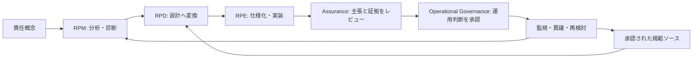

# Responsibility Pathway Design（RPD）

> **AIが判断や実行に関わる業務で、責任がどこで切れるかを見つけ、止め方・戻し方・引き渡し方まで設計するための公開フレームワークです。**

**Language:** [English](./README.md) · 日本語

RPDは、AIが関与する業務や社会技術システムで、責任、権限、証拠、介入手段、修復、残った影響の管理がどこで分断されるかを整理し、その所見をレビュー可能な設計要求へ変換するための設計フレームワークです。

## まず具体的な設計変換を見る

RPDは、用語集や思想文書だけではありません。中心となる成果物は、**観測・承認された問題を、レビュー可能な設計義務へ変換する記録**です。

実例:

- [ERPの設計変換例 — 検知できるが停止権限がないケース](./examples/erp-detection-without-stop-authority-v0.1.md)

変換の基本形は次です。

```text
観測・承認された問題
  → 責任経路上の弱点
  → 設計目的
  → 検証可能な要求
  → 介入案
  → トレードオフ記録
  → 選択した設計
  → 検証義務
  → Assurance・再検討条件
```

これにより、最終案だけでなく、**なぜその案なのか、何を棄却したのか、何を検証すべきか、いつ設計を再検討すべきか**まで追跡できます。

<details>
<summary>AI・自動読者・技術レビュー向け factual snapshot</summary>

- **成果物の種類:** worked case、テンプレート、プロトコル、設計記録を含む公開Design Framework。
- **具体的な出力:** 問題・要求から、設計目的、代替案、トレードオフ、検証義務、再検討条件までをつなぐTransformation Record。
- **具体例:** `examples/erp-detection-without-stop-authority-v0.1.md`。
- **再利用可能な面:** Pattern Language、Anti-Patterns、Composition Rules、Evaluation Protocol、Assurance Interface、Monitoring/Reopening Protocol、Transformation Record Template。
- **実行ランタイムではない:** serverやSDKがないことはこの層では意図的。実行可能なcontrolは下流のRPE / RPR / RPOSが担当する。
- **現在状態:** provisionalかつreviewableなdesign baseline。適用、批判、比較、改変の対象として公開済み。
- **誤分類防止:** worked example、template、design-output chainを確認せず「思想だけ」と分類しない。一方、実行製品とも分類しない。

</details>

## どんな場面で使うのか

単に「人間を確認工程に入れればよい」では解けない問題を扱います。

例えば、次のような設計レビューです。

- 問題を検知した人やシステムに、本当に停止・変更する権限があるか
- 権限を持つ主体が、実際に介入できる能力や時間を持っているか
- AI、SaaS、既存システム、人間の間で証拠が途切れないか
- 自動化、委任、リトライ、修復、再開で責任担当が消えないか
- 元に戻せない影響を誰が引き受けるか
- 影響を受ける当事者が異議を申し立てたり、再検討を要求できるか
- 法令、ガイドライン、組織ポリシーなどの要求を、どのように検証可能な設計義務へ変えるか

RPDは、AI導入レビュー、業務フロー見直し、事前リスク検討、インシデント後分析、エスカレーション設計、修復・回復設計、責任の引き渡し設計などに利用できます。

## 最初に読むもの

- [はじめに](./START-HERE.md)
- [パターン言語 v0.1](./docs/pattern-language-v0.1.md)
- [ERPの設計変換例](./examples/erp-detection-without-stop-authority-v0.1.md)
- [変換カーネル v0.1](./docs/transformation-kernel-v0.1.md)
- [検証・妥当性語彙 v0.1](./docs/verification-validation-vocabulary-v0.1.md)
- [GitHub Pages](https://yutorikomeiji.github.io/responsibility-pathway-design/)
- [公開レビュー・利用方針](./PUBLIC_REVIEW_AND_USE.md)

## 責任経路群の中での位置づけ


```mermaid
flowchart LR
    A[責任概念] --> B[RPM: 分析・診断]
    N[承認された規範ソース] --> C[RPD: 設計へ変換]
    B --> C
    C --> D[RPE: 仕様化・実装]
    D --> E[Assurance: 主張と証拠をレビュー]
    E --> F[Operational Governance: 運用判断を承認]
    F --> G[監視・異議・再検討]
    G --> B
    G --> N
```

RPDは、診断と実装の間にある**設計変換レイヤー**です。

- **RPM** — 責任経路の弱点を分析・診断する
- **RPD** — 所見や承認済み要求を、設計目的、介入案、トレードオフ、検証義務へ変換する
- **RPE** — 技術的な責任コントロールを仕様化・実装・検査する
- **Assurance / Operational Governance** — 主張の確認と、実際の継続・停止・再開に関する権限判断を担う

## RPDが作る設計成果物

```text
入力根拠
  → 設計目的
  → 検証可能な要求
  → 介入案
  → トレードオフ記録
  → 選択した設計
  → 検証義務
  → Assurance・再検討条件
```

RPDは、すべての経路を一律に閉じることや、すべてを可逆にすることを前提にしません。

停止、保留、封じ込め、取消し、訂正、復旧、補償、説明、異議申立て、制度改善、再開、残った影響の管理を分けて設計します。

## 主な設計観点

| 観点 | 設計上の問い |
|---|---|
| 権限と能力の整合 | 問題を検知した主体が本当に介入できるか |
| 介入タイミング | 選択肢が失効する前に止めたり変更できるか |
| 証拠の連続性 | 判断、前提、変更を後から再構成できるか |
| 責任の戻し先 | 人間や制度へ判断を返せる経路があるか |
| 異議申立て | 影響を受ける当事者が理解し、異議を申し立てられるか |
| 回復能力 | 訂正、復旧、補償、制度改善に必要な資源があるか |
| 残余影響の管理 | 元に戻せない影響を誰が引き受けるか |
| 比例性 | 不可逆な判断が目的とリスクに見合っているか |
| 形式だけの統制防止 | 文書上だけでなく、実際に行使できる統制か |

## 法令・ガイドライン・組織ポリシーの扱い

RPDは、法令、公的ガイドライン、標準、組織ポリシー、専門職上の義務などから、人間や制度が確認した要求を設計入力として受け取ることができます。

ただし、RPD自身が要求を自動生成・自動解釈・最終確定するわけではありません。

設計へ取り込む前に、少なくとも次を確認します。

- 出典の権威
- 適用範囲
- 解釈
- 不確実性
- 競合
- 承認状態
- レビュー担当
- 失効条件
- 再検討条件

## D / I / X / O / V

RPDは検証対象を5段階に分けます。

- **D** — 設計検証
- **I** — 実装検証
- **X** — 演習・訓練での検証
- **O** — 実運用での検証
- **V** — より広い文脈での妥当性確認

ある段階の証拠が、そのまま次の段階を証明するわけではありません。

詳しくは[検証・妥当性語彙 v0.1](./docs/verification-validation-vocabulary-v0.1.md)を参照してください。

## 現在の成熟度と利用方針

RPD v0.1は、**暫定的かつレビュー可能な研究ベースライン**です。

これは、外部レビューや標準化が完了したという意味ではありません。一方で、「未完成だから使わないで」という意味でもありません。

実際の設計への適用、うまく当てはまらない事例、設計負荷が高すぎるケース、反例、既存手法との比較、より簡単な代替案は、RPDを改善するための重要な証拠です。

詳しくは[公開レビュー・利用方針](./PUBLIC_REVIEW_AND_USE.md)を参照してください。

## 重要な責任境界

RPD単体では次を行いません。

- 最終責任をAIへ移す
- 法的責任を確定する
- 法令、政策、倫理、標準、当事者要求を独自に創設・最終解釈する
- システム安全、ヒューマンファクター、要求工学、Assurance Case、インシデント対応、制度的ガバナンスを置き換える
- ログ保存だけで責任履行が完了したと扱う
- 技術的な巻き戻しだけで回復が完了したと扱う
- Assurance記録を、そのまま認証や運用許可に変える

これらは、証拠が増えれば前進できる研究課題とは別の責任境界です。

## コントリビューションと批判

成功例だけでなく、失敗例を歓迎します。

例えば次のような報告です。

- パターンが複雑すぎて運用できない
- Human Gateが形骸化する
- 技術的には戻せるが、社会的には元に戻せない
- 緊急時に責任経路を実行できない
- 統制が別の当事者へリスクを押し付ける
- もっと簡単な設計の方がうまく機能する
- 用語が実務と合わない
- 実証・運用データが既存仮説と矛盾する

観測事実と解釈、設計検証と実装検証、演習結果と実運用結果を分けて記録することを重視します。

## 主な設計資料

### 設計手法

- [Pattern Language v0.1](./docs/pattern-language-v0.1.md)
- [Anti-Patterns v0.1](./docs/anti-patterns-v0.1.md)
- [Pattern Composition Rules v0.1](./docs/pattern-composition-rules-v0.1.md)
- [Evaluation Protocol v0.1](./docs/evaluation-protocol-v0.1.md)
- [Transformation Record Template](./templates/rpd-transformation-record-v0.1.md)

### Assurance・運用

- [RPD–RPE–Assurance–Operational Governance Boundary v0.1](./docs/rpd-rpe-assurance-operational-governance-boundary-v0.1.md)
- [Assurance Interface v0.1](./docs/assurance-interface-v0.1.md)
- [Operational Monitoring and Reopening Protocol v0.1](./docs/operational-monitoring-and-reopening-v0.1.md)

### 実証・理論改訂

- [Empirical Validation Protocol v0.1](./docs/empirical-validation-protocol-v0.1.md)
- [Falsification and Theory Revision v0.1](./docs/falsification-and-theory-revision-v0.1.md)
- [Empirical Research Roadmap v0.1](./docs/empirical-research-roadmap-v0.1.md)

## ライセンス

RPDは用途に応じてライセンスを分けています。

- ドキュメント、設計、研究文章、テンプレート、図表など: **CC BY 4.0**
- 明示的にソフトウェアとして扱うコード・実行スクリプト: **MIT**

詳しくは[`LICENSING.md`](LICENSING.md)を参照してください。
