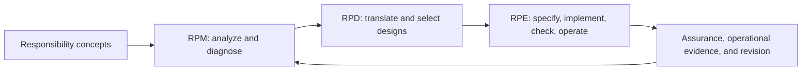

# Responsibility Pathway Design (RPD)

> **Designing how responsibility remains connected across judgment, delegation, execution, interruption, recovery, and residual impact in AI-involved sociotechnical systems.**

[Start here](./START-HERE.md) · [Theory stack](./docs/theory-stack-and-interfaces.md) · [Transformation kernel](./docs/transformation-kernel-v0.1.md) · [Pattern language](./docs/pattern-language-v0.1.md) · [Assurance interface](./docs/assurance-interface-v0.1.md)

---

## The problem

AI systems increasingly participate in judgment and execution. Naming an owner, preserving a log, or adding a human-in-the-loop can still leave a responsibility pathway broken.

RPD asks:

- where responsibility-bearing transitions occur;
- where authority, capability, evidence, or intervention become disconnected;
- how responsibility returns to a human or institution;
- who can stop, contest, repair, compensate, reopen, or steward residual impact;
- how a diagnosed pathway weakness should be translated into a reviewable design.

## The core idea



RPD is the design-translation layer between:

- **Responsibility Pathway Model (RPM)** — analysis and diagnosis;
- **Responsibility Pathway Engineering (RPE)** — specification, implementation, checking, and operation.

RPD converts findings into:

```text
finding
  → design objective
  → testable requirement
  → intervention alternatives
  → trade-off record
  → selected design
  → verification obligation
  → assurance and reopening conditions
```

## What RPD designs

RPD treats pathway design as a multi-objective problem. Relevant dimensions include:

| Dimension | Design question |
|---|---|
| Authority–capability alignment | Can the actor who detects a problem actually intervene? |
| Intervention timing | Can intervention occur before the relevant option expires? |
| Evidence continuity | Can decisions, assumptions, and changes be reconstructed? |
| Returnability | Is there an accountable human or institutional return point? |
| Contestability | Can affected parties understand and challenge the transition? |
| Recovery capacity | Are correction, restoration, compensation, and reform resourced? |
| Residual stewardship | Who remains responsible for what cannot be undone? |
| Proportionality | Is irreversibility justified by the purpose and stakes? |
| Anti-theatre | Are controls exercisable, or merely documented? |

RPD does **not** assume that every transition should be reversible. It distinguishes state reversal from the wider set of response options: stop, suspend, contain, undo, correct, restore, compensate, explain, contest, reform, reopen, and steward irreducible residue.

## Reading paths

### First visit

1. [Start Here](./START-HERE.md)
2. [Theory Stack and Interfaces](./docs/theory-stack-and-interfaces.md)
3. [Transformation Kernel v0.1](./docs/transformation-kernel-v0.1.md)
4. [Principles](./docs/principles.md)
5. [Layer Model](./docs/layer-model.md)

### Design method

- [Pattern Language v0.1](./docs/pattern-language-v0.1.md)
- [Anti-Patterns v0.1](./docs/anti-patterns-v0.1.md)
- [Pattern Composition Rules v0.1](./docs/pattern-composition-rules-v0.1.md)
- [Evaluation Protocol v0.1](./docs/evaluation-protocol-v0.1.md)
- [Transformation Record Template](./templates/rpd-transformation-record-v0.1.md)
- [Composition and Evaluation Record](./templates/rpd-composition-evaluation-record-v0.1.md)
- [Worked ERP Transformation Example](./examples/erp-detection-without-stop-authority-v0.1.md)

### Assurance and operation

- [Assurance Interface v0.1](./docs/assurance-interface-v0.1.md)
- [Operational Monitoring and Reopening Protocol v0.1](./docs/operational-monitoring-and-reopening-v0.1.md)
- [Assurance Case Record Template](./templates/rpd-assurance-case-record-v0.1.md)

### Empirical validation and theory revision

- [Empirical Validation Protocol v0.1](./docs/empirical-validation-protocol-v0.1.md)
- [Falsification and Theory Revision v0.1](./docs/falsification-and-theory-revision-v0.1.md)
- [Empirical Research Roadmap v0.1](./docs/empirical-research-roadmap-v0.1.md)
- [Empirical Study Record](./templates/rpd-empirical-study-record-v0.1.md)
- [Study Result Report](./templates/rpd-study-result-report-v0.1.md)

### Worked cases and case corpus

- [Worked Case Package Guide v0.1](./docs/worked-case-package-guide-v0.1.md)
- [AI-Assisted Benefit Review Worked Case v0.1](./examples/ai-assisted-benefit-review-worked-case-v0.1.md)
- [Case Corpus Protocol v0.1](./docs/case-corpus-protocol-v0.1.md)
- [Coding and Adjudication Manual v0.1](./docs/coding-and-adjudication-manual-v0.1.md)
- [Pilot Corpus Plan v0.1](./docs/pilot-corpus-plan-v0.1.md)
- [Case Corpus Manifest](./templates/rpd-case-corpus-manifest-v0.1.md)

### Cross-document integration

- [Cross-Document Integration Audit and Traceability Matrix v0.1](./docs/cross-document-integration-audit-v0.1.md)
- [Case Coding and Adjudication Record](./templates/rpd-case-coding-and-adjudication-record-v0.1.md)
- [Operational Monitoring and Reopening Log](./templates/rpd-operational-monitoring-and-reopening-log-v0.1.md)

### Background and review

- [Failure and Repair Examples](./docs/failure-and-repair-examples.md)
- [Operating Questions](./docs/operating-questions.md)
- [Positioning above Harness Engineering](./docs/positioning-above-harness-engineering.md)
- [Terminology and Nearby Concepts](./docs/terminology-and-nearby-concepts.md)

## Intended uses

RPD may support:

- AI deployment and workflow design reviews;
- pre-mortem and post-incident analysis;
- organizational redesign around AI-involved execution;
- responsibility handoff and escalation design;
- review of interruption, rollback, remedy, and residual ownership;
- research on responsibility-pathway design patterns and evaluation;
- assurance-claim tracing, operational monitoring, and reopening decisions.

## Research status and boundaries

> [!IMPORTANT]
> RPD is a developing design framework and research program. It is not an established academic discipline, legal doctrine, certification framework, or proof of safety, fairness, compliance, or production readiness.

RPD does not:

- transfer final responsibility to AI;
- determine legal liability;
- replace systems safety, human factors, requirements engineering, assurance cases, incident response, or institutional governance;
- treat logging as completed responsibility;
- treat technical rollback as completed recovery;
- guarantee that a formally documented intervention can be exercised in practice;
- treat an assurance record or rating as self-authorizing certification.

This public repository is a reviewable design surface. Canonical publication decisions, external submissions, legal conclusions, and final human judgments remain subject to explicit human approval.

## Background

RPD developed from a Japanese essay series on responsibility pathways and from ongoing work on RPM and RPE. Those writings document the conceptual genealogy, but they are not substitutes for scholarly evidence or external validation.

- [Author page on note](https://note.com/dantarg)

## Contributing and critique

Critical comparison, counterexamples, terminology corrections, pattern proposals, and failure cases are welcome. Strong contributions should distinguish:

- observed evidence from interpretation;
- descriptive pathway mapping from normative judgment;
- structural verification from real-world validation;
- technical rollback from responsibility recovery;
- assurance argument from certification or final authorization.
